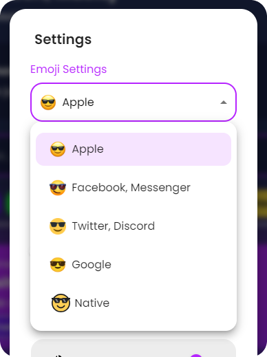
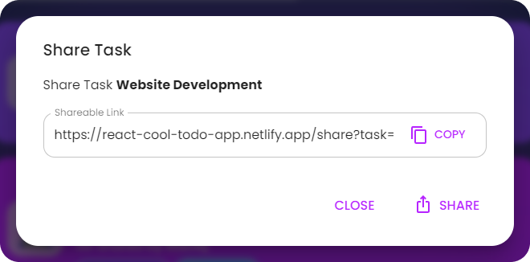
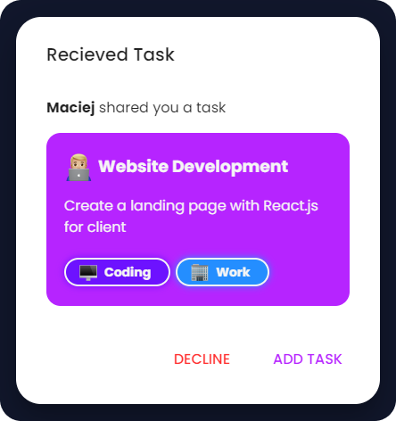
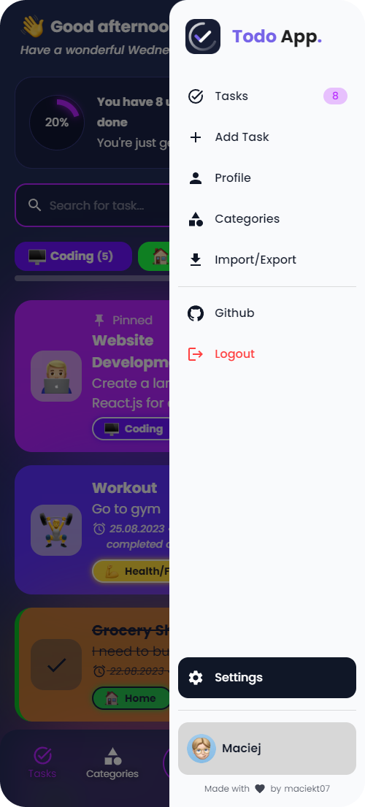
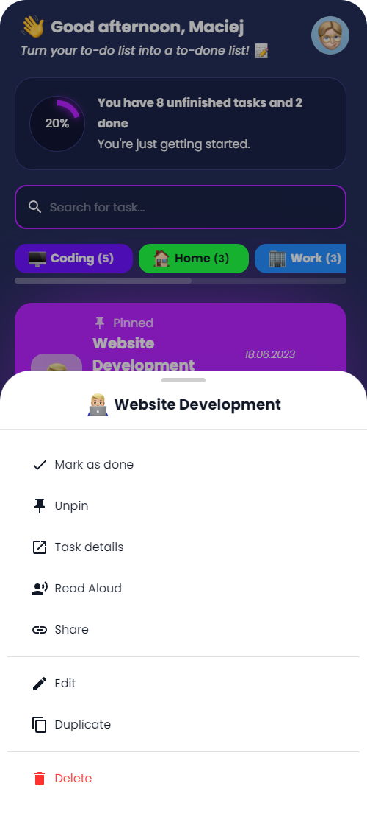
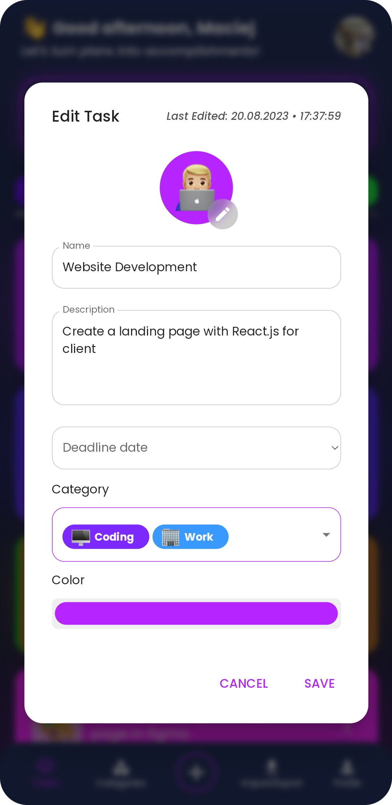
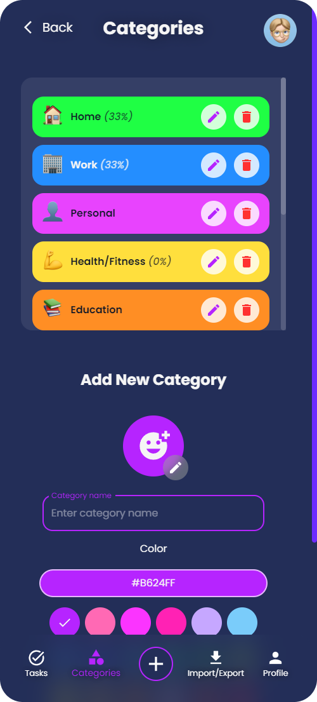
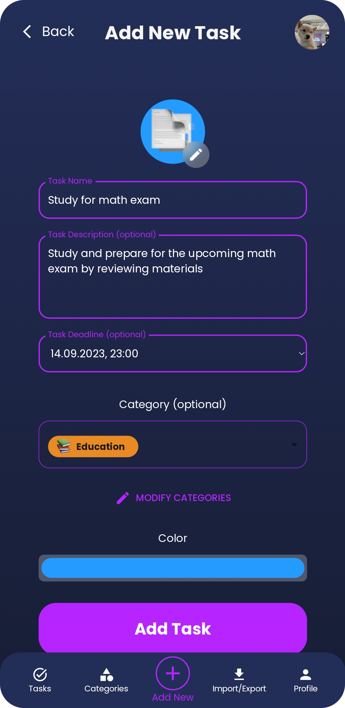
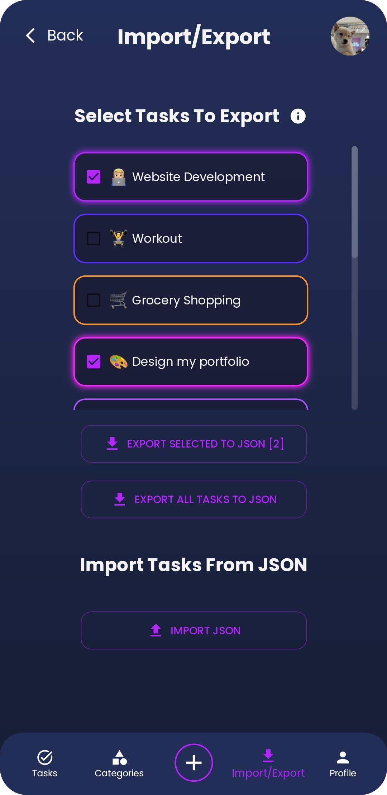
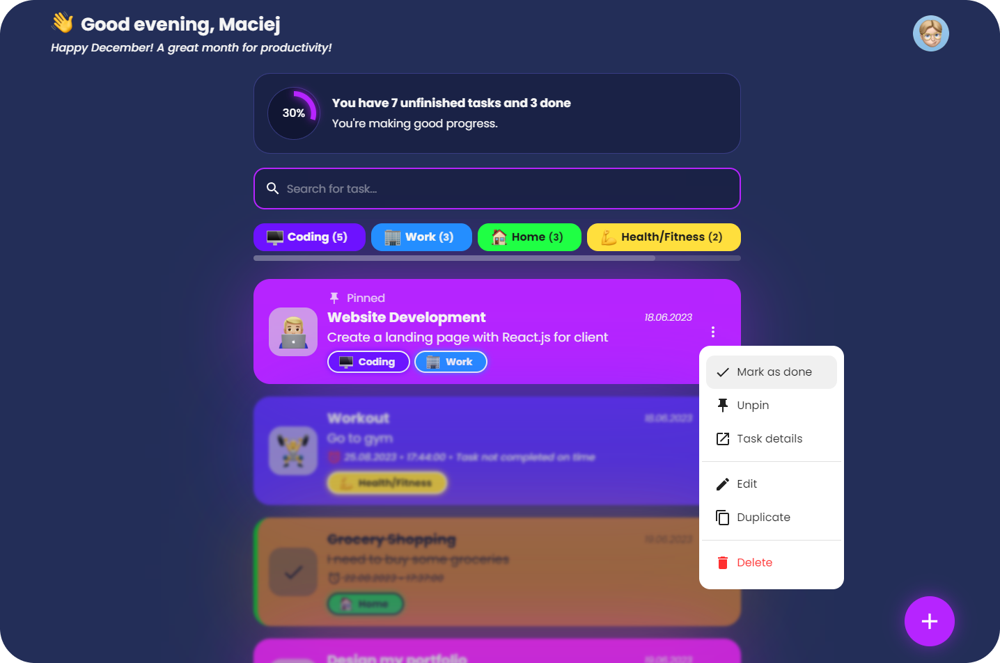

<!-- prettier-ignore -->

<h1>CHECKBOX - 📝React.js Todo App</h1>

> Welcome to CheckBox, the cutting-edge To-Do app designed to simplify your daily tasks and boost your productivity!

## General info
This project was built using React.js and JavaScript as a way to not only help organise the user's schedule, but to also apply our knowledge of React Native, CRUD and general App building.
CheckBox provides a seamless and intuitive user experience for managing your to-do lists with efficiency and style.

## ⚡ Features

- **Local Storage**: Save all your tasks locally.
- **Custom Emojis**: The app features different emoji styles to choose from, including Apple, Facebook, Twitter, Google and Native.
<!--   -->
- **Share tasks by link**: Easily share your tasks with others using a link. 
<!--   -->
- **It has a clean and responsive design**, ensuring a smooth user experience across different devices.
- **Customizable Categories**: Users can create and personalize task categories to suit their preferences.
- **Search Tasks**: Search functionality allows you to filter tasks by name or description, making it easy to find what you need.
- **Task Reading Aloud**: Option to have tasks read aloud, with a selection of voices to choose from.  
  
- **Import/Export Tasks**: Users can now import and export tasks to/from JSON files. This feature allows users to back up their tasks or transfer them to other devices easily.
- **Works offline**: This app is a Progressive Web App (PWA), which means it can be installed on your device and used even when you're offline. You can access and manage your tasks without an internet connection, ensuring uninterrupted productivity.

## 📷 Screenshots

## Technologies
* React.JS
* Javascript

## Dependencies
* async-storage
* react-navigation
etc

## ⚙️ Installation

To install and run the project locally, follow these steps:

- Clone the repository: `git clone https://github.com/Divinelewis/CheckBox-Web-App.git`
- Install the dependencies: `npm install`
- Start the development server: `npm run dev`

The app will now be running at [http://localhost:5173/](http://localhost:5173/).

## Contact
* Nkechi Nnadi - nkaduba@gmail.com - @Kaych3e(github)
* Divine Lewis - divinitysoft0@gmail.com - @Divinelewis(github)
